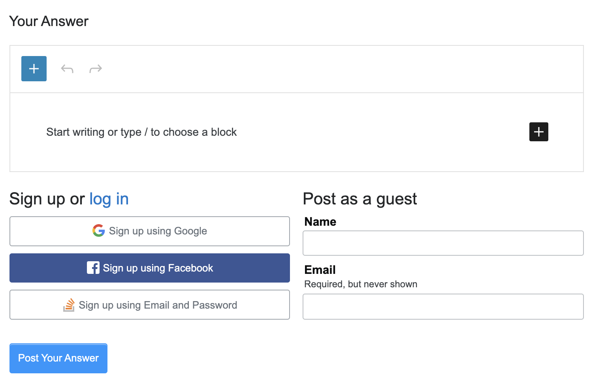

# Gutenberg Chrome Extension

A Chrome extension that adds a button to the toolbar. When the button is clicked it will convert every `textarea` on the page to a Gutenberg editor.

The editor will load and save content to the `textarea` in Markdown format, making it compatible with a variety of sites. Here's Gutenberg on Stack Overflow:

## Development

The editor is found in `src`, with the Chrome code in `background.js` and `manifest.json`.

Running `yarn start` will build the development version of the extension.

From the Chrome extensions page you can switch to 'developer mode' and then 'Load unpacked'. Select the `gutenberg-chrome` directory and it will load the extension.
